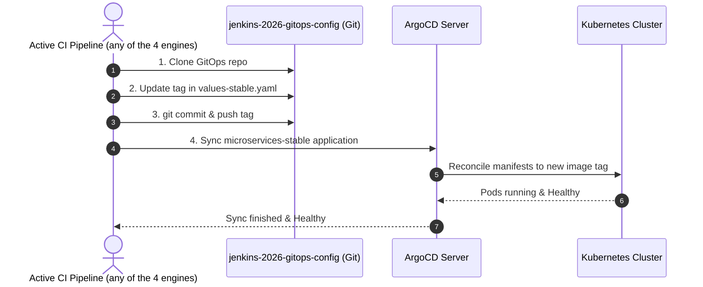

# jenkins-2026-gitops-config

> **GitOps configuration repository** for the [`jenkins-2026`](https://github.com/nubenetes/jenkins-2026) proof-of-concept.
>
> This repo is the **Git source of truth for ArgoCD**. The active CI engine writes image tags here; ArgoCD reads them and reconciles the cluster state. You do not deploy anything manually from this repo.

> ## ⚠️ `main` is CI-writable — do NOT require pull requests on it
>
> The active CI engine's **GitOps Update** step pushes image-tag bumps **directly** to `main` (`git push origin main`). Therefore:
> - `main` is protected only against **force-pushes/deletions** — **not** with *require-a-pull-request*.
> - Enabling "Require a pull request before merging" **wedges every deploy**: the CI's PAT-authenticated push is rejected (an admin PAT does **not** bypass branch protection) and the image tags freeze.
> - This is deliberate — and the **opposite** of the [`jenkins-2026`](https://github.com/nubenetes/jenkins-2026) infra repo, whose `main` is strict-GitFlow-protected (PR-from-`develop`-only) because it is human-reviewed.
> - Image-tag bumps here are machine-managed, not human-reviewed, so `main` must accept the CI's direct push.

## Table of Contents
- [Golden Path IDP Infrastructure](#golden-path-idp-infrastructure)
- [Relationship to `jenkins-2026`](#relationship-to-jenkins-2026)
- [Repository Layout](#repository-layout)
- [How Image Tags Are Updated](#how-image-tags-are-updated)
- [ArgoCD Applications](#argocd-applications)
  - [`microservices` ApplicationSet](#microservices-applicationset)
  - [Standalone Applications](#standalone-applications)
- [Helm Chart: `helm/microservices`](#helm-chart-helmmicroservices)
  - [Key values schema](#key-values-schema)
  - [Environments](#environments)
- [Postgres (CNPG)](#postgres-cnpg)
- [NetworkPolicies (zero-trust)](#networkpolicies-zero-trust)
- [Branch Strategy](#branch-strategy)
  - [Why only the `main` branch?](#why-only-the-main-branch)
  - [The `develop` branch — used by the optional develop tier](#the-develop-branch--used-by-the-optional-develop-tier)
  - [`main` branch protection — CI-writable](#main-branch-protection--ci-writable-do-not-require-pull-requests)
- [OTel Auto-Instrumentation](#otel-auto-instrumentation)
- [Related Repositories](#related-repositories)
- [Setup & Forking Guide](#setup--forking-guide)
- [Release & Versioning Strategy](#release--versioning-strategy)
- [Git History and Privacy](#git-history-and-privacy)
- [Do Not Edit Manually](#do-not-edit-manually)

## Golden Path IDP Infrastructure

This repository defines the GitOps state for the modernized **Internal Developer Platform (IDP)** architecture on GKE.

### Decoupled Core Components
In alignment with 2026 Cloud-Native best practices, all platform infrastructure manifests are decoupled from CI build execution and versioned under the infra repo's `infrastructure/` directory. Some are GitOps-managed via ArgoCD; the ordering-sensitive ones (the `ComputeClass`, NetworkPolicies, the live per-app Gateway `HTTPRoute`s) are applied by the infra repo's idempotent scripts (`01-namespaces.sh`, `09-gateway.sh`) — see the infra repo's `docs/201-ARCHITECTURE.md` for the imperative-vs-GitOps split:
* **Elastic Node Auto-Provisioning (NAP)**: GKE-native (GA) node auto-provisioning driven by a Custom `ComputeClass` under `infrastructure/compute-classes/` in the main repo, auto-creating **Spot, scale-to-zero** node pools for ephemeral build agents (the Google-supported equivalent of Karpenter — there is no production-ready Karpenter provider for GCP).
* **GKE Gateway API Routing**: Secure HTTPS traffic routing for Jenkins and Headlamp is mapped under `infrastructure/gateway/` using native `Gateway`, `HTTPRoute`, and `BackendTLSPolicy` (zero-trust TLS to pods).
* **Workload-Aware scheduling & Security**: `PodGroup` gang scheduling via the scheduler-plugins CRD (`scheduling.x-k8s.io/v1alpha1`, `infrastructure/scheduling/PodGroup.yaml`) plus a constrained-impersonation RBAC `ClusterRole` (resourceNames-scoped `impersonate` verbs, `infrastructure/headlamp/ImpersonationPolicy.yaml`) for Headlamp UI users.

---

## Relationship to `jenkins-2026`

```
+--------------------------------------------------------------------+
|                nubenetes/jenkins-2026 (infra repo)                 |
|                                                                    |
|  scripts/        --- bootstrap cluster, install Jenkins/ArgoCD     |
|  jenkins/        --- JCasC, Job DSL, shared pipeline library       |
|  helm/           --- Helm charts for supporting services           |
|  argocd/         --- ApplicationSet/Application manifests          |
|  observability/  --- OTel collector, Grafana dashboards            |
+------------------------+-------------------------------------------+
                         | scripts/08.5-argocd.sh registers
                         | THIS repo as ArgoCD source
                         v
+--------------------------------------------------------------------+
|          nubenetes/jenkins-2026-gitops-config (this repo)          |
|                                                                    |
|  argocd/            --- Application / AppSet manifests (deployed   |
|                         FROM infra repo, stored here for clarity)  |
|  helm/microservices/--- Helm chart + env values files              |
|    values-stable.yaml<- active CI engine writes tags             |
+--------------------------------------------------------------------+
```

| Action | Who does it | Where |
|--------|------------|-------|
| Bootstrap cluster & install ArgoCD | `scripts/08.5-argocd.sh` | `jenkins-2026` |
| Register this repo in ArgoCD | `scripts/08.5-argocd.sh` | `jenkins-2026` |
| Build & push container images | Active CI engine — one of four, selected by `ci.engine`: Jenkins (`MicroservicesPipeline`), Tekton, GitHub Actions/ARC, or Argo Workflows | `jenkins-2026/vars/`, `jenkins-2026/tekton/`, `jenkins-2026/jenkins/pipelines/seed/microservices-ci.yml.tmpl`, or `jenkins-2026/argoworkflows/` |
| **Write image tag to values file** | Active CI engine — Jenkins (`vars/microservicesDeploy.groovy`), Tekton (`gitops-deploy` Task), GitHub Actions (rendered `microservices-ci` workflow's GitOps-bump step), or Argo Workflows (`gitops-deploy` step) | **this repo** |
| Detect tag change & deploy to cluster | ArgoCD (automated sync) | cluster |
| Grafana dashboard push | `scripts/07-grafana-dashboards.sh` | `jenkins-2026` |

---

## Repository Layout

```
jenkins-2026-gitops-config/
├── argocd/
│   ├── microservices-appset.yaml   # ApplicationSet: generates microservices-stable Application
│   ├── microservices-project.yaml  # AppProject: scope for the microservices Application
│   ├── headlamp-app.yaml           # Application: Headlamp Kubernetes UI
│   ├── pgadmin-app.yaml            # Application: pgAdmin 4 Postgres UI
│   └── cnpg-app.yaml               # Application: CloudNative-PG Operator (CNPG)
└── helm/
    └── microservices/
        ├── Chart.yaml                 # Helm chart metadata
        ├── values.yaml                # Base defaults / schema documentation
        ├── values-stable.yaml         # Stable env (namespace: microservices, branch: main)
        ├── values-develop.yaml        # Dormant develop-tier values (only used if a develop track is re-enabled)
        └── templates/
            ├── deployment.yaml        # Deployment per service in .Values.services
            ├── service.yaml           # ClusterIP Service
            ├── ingress.yaml           # Ingress (enabled per platform)
            ├── route.yaml             # Gateway API HTTPRoute / OpenShift Route (per platform)
            ├── instrumentation.yaml   # OTel Instrumentation CR (auto-instruments JVM services)
            ├── postgres.yaml          # CNPG Cluster & Pooler CR per service
            ├── networkpolicies.yaml   # Zero-trust: default-deny + gateway / microservice / postgres policies
            ├── logback-configmap.yaml # ECS-JSON structured-logging config
            ├── gateway-cache-patch.yaml # gateway Hazelcast cache config
            ├── limitrange.yaml        # Default container resource limits
            ├── resourcequota.yaml     # Namespace resource cap
            └── _helpers.tpl           # Shared template helpers
```

> **Note**: the `argocd/` manifests here are **reference mirrors** and can lag the deployed reality — `scripts/08.5-argocd.sh` applies the copies in the **infra repo's** `argocd/` directory (where, e.g., `cnpg-operator` + `pgadmin` are now rendered by the `platform-postgres` app-of-apps and chart versions are pinned). The infra repo is authoritative for Application manifests; this repo is authoritative for `helm/microservices/`.

---

## How Image Tags Are Updated

The **active CI engine** — one of **four**, selected by `ci.engine` in the infra repo: **Jenkins** (default), **Tekton**, **GitHub Actions / ARC**, or **Argo Workflows** — updates the image tag here on every successful build. With Jenkins it is the `microservicesDeploy.groovy` shared-library step; with Tekton the `gitops-deploy` Task; with GitHub Actions the GitOps-bump step of the rendered `microservices-ci` workflow; with Argo Workflows the `gitops-deploy` step of the microservices WorkflowTemplate. All four clone this repo, bump the tag in the values file with `yq`, and push:



The updated [`values-stable.yaml`](helm/microservices/values-stable.yaml) (or [`values-develop.yaml`](helm/microservices/values-develop.yaml)) is the **only file the CI engine ever modifies** in this repo — identically whichever of the four engines is active. Everything else is managed by humans or by `scripts/08.5-argocd.sh` in the infra repo. (Tekton itself is GitOps-managed by ArgoCD from the **infra** repo's `tekton/` + `argocd/tekton/`, not from here — this repo holds only the deployment target, which is CI-engine-agnostic. See [`docs/403-TEKTON.md`](https://github.com/nubenetes/jenkins-2026/blob/main/docs/403-TEKTON.md).)

---

## ArgoCD Applications

All Applications are **installed by `scripts/08.5-argocd.sh`** in the infra repo, from the **infra repo's own `argocd/` manifests**. The copies under [`argocd/`](argocd/) here are **non-authoritative reference copies** — nothing (ArgoCD or any script) consumes them, and they may lag the deployed versions; each file carries a header saying so. (The standalone CNPG/pgAdmin Applications below have since been superseded by the infra repo's `argocd/platform-postgres/` app-of-apps.)

### `microservices` ApplicationSet
Generates the stable application:

| Generated App | Namespace | Values file | Branch |
|---------------|-----------|-------------|--------|
| `microservices-stable` | `microservices` | [`values-stable.yaml`](helm/microservices/values-stable.yaml) | `main` |

> The stable app's `targetRevision` is templated (`{{branchStable}}`) with the infra **deploy branch** (`J2026_SELF_REPO_BRANCH`): `main` in production, but a `Day1` dispatched from the infra repo's `develop` branch points the stable app at this repo's `develop` branch to validate the whole platform before promotion.

It uses `prune: true` + `selfHeal: true`. Only the **stable** application is generated; the develop tier is **disabled by default** (the AppSet emits a `develop` element only when `microservices.developTrackEnabled` is set in the infra repo). The dormant [`values-develop.yaml`](helm/microservices/values-develop.yaml) stays in the chart for when that track is re-enabled — see [Branch Strategy](#branch-strategy).

### Standalone Applications

| Application | Source | Target Namespace | Notes |
|-------------|--------|-----------------|-------|
| `headlamp` | upstream `headlamp` chart + `helm/headlamp/values.yaml` (infra repo, multi-source) | `headlamp` | Kubernetes UI, Google OIDC |
| `platform-postgres` (app-of-apps) | `argocd/platform-postgres/` (infra repo) | `argocd` | parent of the two rows below |
| ├ `cnpg-operator` | `cloudnative-pg/cloudnative-pg` chart (version pinned in the infra repo's `argocd/platform-postgres/values.yaml`) | `cnpg-system` | ServerSideApply + Replace (huge CRDs) |
| └ `pgadmin` | `helm/pgadmin/` (infra repo) | `pgadmin` | Postgres admin UI |

---

## Helm Chart: `helm/microservices`

A single chart renders all services defined in `values.services.*`. Each service entry specifies its image tag and per-service config; the chart generates a `Deployment`, `Service`, `Instrumentation` CR, and `PostgresCluster` CR for each.

### Key values schema

```yaml
global:
  platform: gke          # gke | eks | aks | openshift

namespace: microservices  # overridden per-env by values-stable.yaml
env: stable               # "stable" → deployment.environment OTel attribute
registry: ghcr.io/nubenetes/jenkins-2026-microservices
imagePullSecret: ghcr-credentials

otel:
  collectorEndpoint: http://otel-collector-gateway.observability.svc.cluster.local:4317

services:
  gateway:
    type: java
    image:
      repository: gateway
      tag: main-16        # ← the active CI engine bumps this via yq on every build (immutable `<branch>-<build#>[-<sha8>]` tag, not a bare SHA)
    port: 8080
    healthPath: /management/health
    resources:
      requests: { cpu: 100m, memory: 256Mi }
      limits:   { cpu: 500m, memory: 512Mi }
    env:
      - name: SPRING_PROFILES_ACTIVE
        value: prod,api-docs
```

### Environments

| File | `env` | `namespace` | ArgoCD App |
|------|-------|-------------|-----------|
| [`values-stable.yaml`](helm/microservices/values-stable.yaml) | `stable` | `microservices` | `microservices-stable` |

The `env` value becomes the `deployment.environment` OTel resource attribute on every trace/metric/log emitted by deployed services, enabling environment filtering in Grafana dashboards.

---

## Postgres (CNPG)

Each service in `.Values.services` gets CNPG `Cluster` and `Pooler` CRs templated by [`templates/postgres.yaml`](helm/microservices/templates/postgres.yaml) (the template ranges over **every** service unconditionally; per-service `postgres.storageSize` / `walStorageSize` are the only optional knobs). The CloudNative-PG Operator (installed via the `cnpg-operator` Application) reconciles these CRs into:

- A highly-available **PostgreSQL 18.3** database tier — **3 instances**, zonal anti-affinity, dynamic primary promotion. The image is **pinned** explicitly (`spec.imageName`, default `ghcr.io/cloudnative-pg/postgresql:18.3-system-trixie`, overridable via `global.postgresImage`) so the DB version is reproducible; bump it deliberately
- Connection pooling managed via native PgBouncer pooler deployments
- Automated Barman Object Store backups targeting Google Cloud Storage (GCS)
- Credentials from the auto-generated secret `postgres-<service>-app` injected into the service pod via `SPRING_DATASOURCE_USERNAME`/`_PASSWORD` and `SPRING_R2DBC_USERNAME`/`_PASSWORD` secretKeyRefs; the corresponding `SPRING_DATASOURCE_URL`/`SPRING_R2DBC_URL` point at the `postgres-<service>-pooler` Service (all traffic goes through PgBouncer)

Two clusters are provisioned in total — one per service in the stable environment:

| Cluster | Namespace |
|---------|-----------|
| `postgres-gateway` | `microservices` |
| `postgres-jhipstersamplemicroservice` | `microservices` |

---

## NetworkPolicies (zero-trust)

[`templates/networkpolicies.yaml`](helm/microservices/templates/networkpolicies.yaml) ships a default-deny posture for the `microservices`
namespace (enforced by GKE **Dataplane V2 / Cilium-eBPF** in the infra repo). Four
policies:

| Policy | Applies to | Key ingress | Key egress |
|---|---|---|---|
| `default-deny` | all pods | none | CoreDNS (`kube-system:53`) only |
| `gateway-policy` | `gateway` pod | **8080** (from the Gateway/LB) | jhipster **8081**, its Postgres **5432**, OTLP `observability` **4317/4318** |
| `microservice-policy` | `jhipstersamplemicroservice` pod | **8081** from the `gateway` pod **and** the four CI run namespaces — **`jenkins`, `tekton-ci`, `arc-runners`, `argo-ci`** (a selector for an absent namespace matches nothing, so listing inactive engines is harmless) — so CI smoke tests can hit `/management/health` | its Postgres **5432**, OTLP **4317/4318** |
| `postgres-policy` | `cnpg.io/cluster` pods | **5432** from the app pods, `pgadmin` ns, intra-cluster | CNPG replication + **443** |

The CI-namespace ingress on 8081 is what lets the active engine's smoke/k6 stage reach the
microservice under enforcement (see [`jenkins-2026` docs/501](https://github.com/nubenetes/jenkins-2026/blob/main/docs/501-PLATFORM_OPERATIONS.md#networkpolicy-matrix)).

---

## Branch Strategy

The GitOps repository uses the `main` branch to target `microservices-stable` deployments. The active CI engine (any of the four — Jenkins, Tekton, GitHub Actions/ARC, Argo Workflows) updates [`helm/microservices/values-stable.yaml`](helm/microservices/values-stable.yaml) on `main` to promote new image versions. The `develop` tier is **off by default** (only `microservices-stable` is generated); its [`values-develop.yaml`](helm/microservices/values-develop.yaml) is activated only when `microservices.developTrackEnabled` is set in the infra repo — see [The `develop` branch](#the-develop-branch--used-by-the-optional-develop-tier) below.

### Why only the `main` branch?

1. **Single Environment Target**: In this unified model the develop tier is disabled by default, leaving a single active target namespace (`microservices`); the develop track can be re-enabled (see below).
2. **Simplified Promotion**: The active CI engine writes image tags directly inside [values-stable.yaml](helm/microservices/values-stable.yaml) on the `main` branch of the GitOps repository.

### The `develop` branch — used by the optional develop tier

A `develop` branch **exists and is wired in**: enabling `microservices.developTrackEnabled` in the infra repo (or the `develop_track` workflow input / `JENKINS2026_DEVELOP_TRACK_ENABLED`) makes the ApplicationSet generate a second `microservices-develop` Application that syncs [`values-develop.yaml`](helm/microservices/values-develop.yaml) from this repo's `develop` branch into the `microservices-develop` namespace, and the active CI engine pushes develop-tier tag bumps to `develop` instead of `main` (stable bumps always go to `main`). With the flag off (the default) only `main` is deployed from.

---

### `main` branch protection — CI-writable (do NOT require pull requests)

`main` is **direct-push** so the CI's *GitOps Update* step can push image-tag bumps unattended. Actual `main` protection (GitHub -> Settings -> Branches):

| Setting | Value | Why |
|---|---|---|
| Require a pull request before merging | **off** | The CI pushes tags straight to `main` (`git push origin main`). Require-PR rejects the PAT push (an admin PAT does **not** bypass protection) and **wedges every deploy**. |
| Required status checks | **none** | Image-tag bumps are machine-generated — nothing to gate them on. |
| Include administrators | **off** | — |
| Allow force pushes | **off** | History on `main` is protected. |
| Allow deletions | **off** | `main` cannot be deleted. |

- **Allowed -> `main`:** direct push (the CI's PAT, or a human pushing a chart/values edit).
- **Forbidden -> `main`:** force-push, branch deletion.

> WARNING: This is the **opposite** of the infra repo [`nubenetes/jenkins-2026`](https://github.com/nubenetes/jenkins-2026), whose `main` is **strict GitFlow** (require-PR from `develop` only, `gitflow-guard` required check, `enforce_admins=on`). The asymmetry is deliberate: the infra repo is human-reviewed, this repo is machine-managed. Full allowed/forbidden matrix: infra repo [`docs/101` -> Branch protection & GitFlow promotion](https://github.com/nubenetes/jenkins-2026/blob/main/docs/101-GITHUB_ACTIONS_WORKFLOWS.md).

## OTel Auto-Instrumentation

The [`templates/instrumentation.yaml`](helm/microservices/templates/instrumentation.yaml) template creates an `Instrumentation` CR (managed by the OTel Operator, installed by `scripts/02-otel-operator.sh`; the collector it exports to is installed by `scripts/03-observability.sh`). This automatically attaches the OTel Java agent to every Spring Boot service pod via a mutating webhook — no changes to application code or Docker images are required.

The agent is configured with:
- `OTEL_EXPORTER_OTLP_ENDPOINT` → the in-cluster OTel Collector gateway
- `OTEL_RESOURCE_ATTRIBUTES` → `deployment.environment`, `service.namespace` (`service.name` is set per service via `OTEL_SERVICE_NAME` in the Deployment template)
- `OTEL_INSTRUMENTATION_LOGBACK_APPENDER_ENABLED=true` → injects `trace_id` into log lines for Loki correlation

---

## Related Repositories

| Repository | Role |
|-----------|------|
| [`nubenetes/jenkins-2026`](https://github.com/nubenetes/jenkins-2026) | **Infra repo** — cluster bootstrap, Jenkins, ArgoCD, Observability, shared pipeline library |
| [`nubenetes/jenkins-2026-gitops-config`](https://github.com/nubenetes/jenkins-2026-gitops-config) | **This repo** — GitOps state: Helm chart, env values, ArgoCD manifests |
| [`nubenetes/jhipster-sample-app-gateway`](https://github.com/nubenetes/jhipster-sample-app-gateway) | **App source** — the JHipster **gateway** (Java / Spring Boot; it *serves* the Angular SPA, it is not itself an Angular app), built as the `gateway` service. Fork of upstream [`jhipster/jhipster-sample-app-gateway`](https://github.com/jhipster/jhipster-sample-app-gateway) (the fork carries a real `develop` branch for branch-based promotion). |
| [`nubenetes/jhipster-sample-app-microservice`](https://github.com/nubenetes/jhipster-sample-app-microservice) | **App source** — the JHipster backend **microservice**, built as `jhipstersamplemicroservice`. Fork of upstream [`jhipster/jhipster-sample-app-microservice`](https://github.com/jhipster/jhipster-sample-app-microservice). |

---

## Setup & Forking Guide

If you are setting up this PoC for yourself or your organization, you must fork this configuration repository along with the main [infrastructure repository](https://github.com/nubenetes/jenkins-2026).

1. **Fork the Repository**: Fork this repository (`jenkins-2026-gitops-config`) to your GitHub account/organization.
2. **Update Main Infra Configuration**: In your fork of the infra repository (`jenkins-2026`), update `config/config.yaml`:
   - `gitops.repoUrl` → your fork of **this** repository (e.g. `https://github.com/<you>/jenkins-2026-gitops-config.git`). This single knob repoints the ArgoCD ApplicationSet **and** all four CI engines' image-tag-bump stages — no script/manifest edits needed. Per-run override: the `JENKINS2026_GITOPS_REPO_URL` env var. See the infra repo's `docs/502-MICROSERVICES_GITOPS.md` § *Repointing the GitOps repo*.
   - `jenkins.selfRepoUrl` and `microservices.git.org` → your own infra/app forks.
3. **Configure Git Credentials**: Ensure you set `GIT_USERNAME` and `GIT_TOKEN` secrets in the infra repository Actions settings, as the active CI engine's pipeline dynamically clones and commits updated image tags to this GitOps repository — the token must have push access to your `gitops.repoUrl` fork.

---

## Release & Versioning Strategy

This repository is versioned **independently** of the infra repo — it keeps its own `v0.9.x` line while `jenkins-2026` is on `v1.x`. There is deliberately **no lockstep**: ArgoCD tracks this repo by **branch**, not tag, and ~90% of commits are machine-written image-tag bumps, so infra release milestones do not map onto this repo.

* **Git Tags**: a `v0.9.N` tag + GitHub Release is cut only when a meaningful chart/manifest milestone lands here.
* **Release Flow**: human chart/config changes are tested on `develop` and merged to `main` via PR (CI tag bumps bypass this and push straight to `main`); the tag is then pushed and a Release drafted.

---

## Git History and Privacy

> [!NOTE]
> This repository's Git history has been fully rewritten and sanitized to remove any private Google identity email addresses and account IDs.
> When collaborating or contributing to this repository, please configure your local Git author settings to use GitHub's private email alias (e.g., `username@users.noreply.github.com`) to avoid accidentally leaking private email addresses in future commits.

---

## Do Not Edit Manually

> [!CAUTION]
> [`helm/microservices/values-stable.yaml`](helm/microservices/values-stable.yaml) is **continuously overwritten by the active CI engine** on every successful build. Manual edits to `services.<name>.image.tag` will be overwritten by the next pipeline run. All other fields (resources, env vars, healthPath) are safe to edit.

For all other infrastructure changes — Jenkins config, observability stack, ArgoCD setup, Helm charts for Headlamp/pgAdmin — make changes in [`nubenetes/jenkins-2026`](https://github.com/nubenetes/jenkins-2026) and re-run the relevant script or GitHub Actions workflow.
