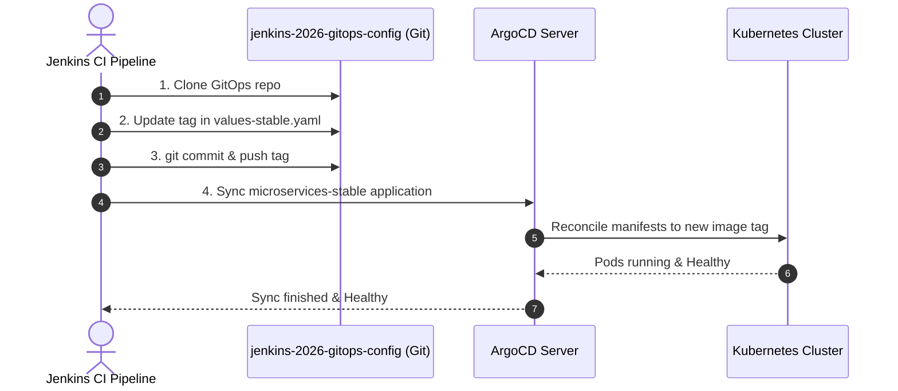

# jenkins-2026-gitops-config

> **GitOps configuration repository** for the [`jenkins-2026`](https://github.com/nubenetes/jenkins-2026) proof-of-concept.
>
> This repo is the **Git source of truth for ArgoCD**. Jenkins CI writes image tags here; ArgoCD reads them and reconciles the cluster state. You do not deploy anything manually from this repo.

## Table of Contents

- [Golden Path IDP Infrastructure](#golden-path-idp-infrastructure)
- [Relationship to `jenkins-2026`](#relationship-to-jenkins-2026)
- [Repository Layout](#repository-layout)
- [How Image Tags Are Updated](#how-image-tags-are-updated)
- [ArgoCD Applications](#argocd-applications)
  - [`microservices` ApplicationSet](#microservices-applicationset)
  - [Standalone Applications](#standalone-applications)
- [Helm Chart: `helm/microservices`](#helm-chart-helmmicroservices)
  - [Key values schema](#key-values-schema)
  - [Environments](#environments)
- [Postgres (PGO v5)](#postgres-pgo-v5)
- [Branch Strategy](#branch-strategy)
  - [Why only the `main` branch?](#why-only-the-main-branch)
  - [Would a `develop` branch make sense?](#would-a-develop-branch-make-sense)
- [OTel Auto-Instrumentation](#otel-auto-instrumentation)
- [Related Repositories](#related-repositories)
- [Setup & Forking Guide](#setup--forking-guide)
- [Git History and Privacy](#git-history-and-privacy)
- [Do Not Edit Manually](#do-not-edit-manually)

## Golden Path IDP Infrastructure

This repository defines the GitOps state for the modernized **Internal Developer Platform (IDP)** architecture on GKE.

### Decoupled Core Components
In alignment with 2026 Cloud-Native best practices, all platform infrastructure manifests are decoupled from CI build execution and managed via GitOps:
* **Elastic Karpenter Autoscaling**: Configured with dynamic `NodePool` and `GCPNodeClass` manifests under `infrastructure/karpenter/` in the main repo to handle autoscaling of ephemeral build agents on Spot instances.
* **GKE Gateway API Routing**: Secure HTTPS traffic routing for Jenkins and Headlamp is mapped under `infrastructure/gateway/` using native `Gateway`, `HTTPRoute`, and `BackendTLSPolicy` (zero-trust TLS to pods).
* **Workload-Aware scheduling & Security**: Maps K8s v1.36 `PodGroup` (Gang scheduling) and `ConstrainedImpersonation` policies for Headlamp UI users.

---

## Relationship to `jenkins-2026`

```
+--------------------------------------------------------------------+
|                nubenetes/jenkins-2026 (infra repo)                 |
|                                                                    |
|  scripts/        --- bootstrap cluster, install Jenkins/ArgoCD     |
|  jenkins/        --- JCasC, Job DSL, shared pipeline library       |
|  helm/           --- Helm charts for supporting services           |
|  argocd/         --- ApplicationSet/Application manifests          |
|  observability/  --- OTel collector, Grafana dashboards            |
+------------------------+-------------------------------------------+
                         | scripts/08.5-argocd.sh registers
                         | THIS repo as ArgoCD source
                         v
+--------------------------------------------------------------------+
|          nubenetes/jenkins-2026-gitops-config (this repo)          |
|                                                                    |
|  argocd/            --- Application / AppSet manifests (deployed   |
|                         FROM infra repo, stored here for clarity)  |
|  helm/microservices/--- Helm chart + env values files              |
|    values-stable.yaml<- Jenkins writes image tags here             |
+--------------------------------------------------------------------+
```

| Action | Who does it | Where |
|--------|------------|-------|
| Bootstrap cluster & install ArgoCD | `scripts/08.5-argocd.sh` | `jenkins-2026` |
| Register this repo in ArgoCD | `scripts/08.5-argocd.sh` | `jenkins-2026` |
| Build & push container images | Jenkins pipeline (`MicroservicesPipeline`) | `jenkins-2026/vars/` |
| **Write image tag to values file** | Jenkins (`vars/microservicesDeploy.groovy`) | **this repo** |
| Detect tag change & deploy to cluster | ArgoCD (automated sync) | cluster |
| Grafana dashboard push | `scripts/07-grafana-dashboards.sh` | `jenkins-2026` |

---

## Repository Layout

```
jenkins-2026-gitops-config/
├── argocd/
│   ├── microservices-appset.yaml   # ApplicationSet: generates microservices-stable Application
│   ├── microservices-project.yaml  # AppProject: scope for the microservices Application
│   ├── headlamp-app.yaml           # Application: Headlamp Kubernetes UI
│   ├── pgadmin-app.yaml            # Application: pgAdmin 4 Postgres UI
│   └── pgo-app.yaml                # Application: CrunchyData Postgres Operator (PGO v5)
+── helm/
    └── microservices/
        ├── Chart.yaml              # Helm chart metadata
        ├── values.yaml             # Base defaults / schema documentation
        ├── values-stable.yaml      # Stable env (namespace: microservices, branch: main)
        └── templates/
            ├── deployment.yaml     # Deployment per service in .Values.services
            ├── service.yaml        # ClusterIP Service
            ├── ingress.yaml        # Ingress (enabled per platform)
            ├── route.yaml          # OpenShift Route (enabled per platform)
            ├── instrumentation.yaml# OTel Instrumentation CR (auto-instruments JVM services)
            ├── postgres.yaml       # PostgresCluster CR per service (PGO v5)
            ├── limitrange.yaml     # Default container resource limits
            ├── resourcequota.yaml  # Namespace resource cap
            └── _helpers.tpl        # Shared template helpers
```

---

## How Image Tags Are Updated

Jenkins runs the `microservicesDeploy.groovy` shared-library step on every successful build:



The updated `values-stable.yaml` is the **only file Jenkins ever modifies** in this repo. Everything else is managed by humans or by `scripts/08.5-argocd.sh` in the infra repo.

---

## ArgoCD Applications

All four Applications are **installed by `scripts/08.5-argocd.sh`** in the infra repo. The manifests live here so ArgoCD can self-heal them via the `microservices` AppProject.

### `microservices` ApplicationSet
Generates the stable application:

| Generated App | Namespace | Values file | Branch |
|---------------|-----------|-------------|--------|
| `microservices-stable` | `microservices` | `values-stable.yaml` | `main` |

Both use `prune: true` + `selfHeal: true`. The legacy develop sandbox environment has been completely pruned.

### Standalone Applications

| Application | Source | Target Namespace | Notes |
|-------------|--------|-----------------|-------|
| `headlamp` | `helm/headlamp/values.yaml` (infra repo) | `headlamp` | Kubernetes UI, Google OIDC |
| `pgadmin` | `helm/pgadmin/` (infra repo) | `pgadmin` | Postgres admin UI |
| `postgres-operator` | `CrunchyData/postgres-operator@v5.7.9` | `postgres-operator` | PGO, ServerSideApply |

---

## Helm Chart: `helm/microservices`

A single chart renders all services defined in `values.services.*`. Each service entry specifies its image tag and per-service config; the chart generates a `Deployment`, `Service`, `Instrumentation` CR, and `PostgresCluster` CR for each.

### Key values schema

```yaml
global:
  platform: gke          # gke | eks | aks | openshift

namespace: microservices  # overridden per-env by values-stable.yaml
env: stable               # "stable" → deployment.environment OTel attribute
registry: ghcr.io/nubenetes/jenkins-2026-microservices
imagePullSecret: ghcr-credentials

otel:
  collectorEndpoint: http://otel-collector-gateway.observability.svc.cluster.local:4317

services:
  gateway:
    type: java
    image:
      repository: gateway
      tag: main           # ← Jenkins writes a new SHA here on every build
    port: 8080
    healthPath: /management/health
    resources:
      requests: { cpu: 100m, memory: 256Mi }
      limits:   { cpu: 500m, memory: 512Mi }
    env:
      - name: SPRING_PROFILES_ACTIVE
        value: prod,api-docs
```

### Environments

| File | `env` | `namespace` | ArgoCD App |
|------|-------|-------------|-----------|
| `values-stable.yaml` | `stable` | `microservices` | `microservices-stable` |

The `env` value becomes the `deployment.environment` OTel resource attribute on every trace/metric/log emitted by deployed services, enabling environment filtering in Grafana dashboards.

---

## Postgres (PGO v5)

Each service that has `postgres: enabled: true` in `values.yaml` gets a `PostgresCluster` CR templated by `templates/postgres.yaml`. The CrunchyData Postgres Operator (installed via the `postgres-operator` Application) reconciles these CRs into:

- A highly-available PostgreSQL 16 cluster (primary + replica)
- Automated pgBackRest backups to an in-cluster repo
- A secret `postgres-<service>-pguser-<service>` injected into the service pod via `JDBC_DATABASE_URL`

Two clusters are provisioned in total — one per service in the stable environment:

| Cluster | Namespace |
|---------|-----------|
| `postgres-gateway` | `microservices` |
| `postgres-jhipstersamplemicroservice` | `microservices` |

---

## Branch Strategy

The GitOps repository uses the `main` branch to target `microservices-stable` deployments. Jenkins updates [values-stable.yaml](file:///home/inafev/github/jenkins-2026-gitops-config/helm/microservices/values-stable.yaml) on `main` to promote new image versions. The legacy `develop` environment has been pruned.

### Why only the `main` branch?

1. **Single Environment Target**: In this unified model, the legacy development sandbox has been pruned, leaving only a single stable target namespace (`microservices`).
2. **Simplified Promotion**: The Jenkins CI pipeline writes image tags directly inside [values-stable.yaml](file:///home/inafev/github/jenkins-2026-gitops-config/helm/microservices/values-stable.yaml) on the `main` branch of the GitOps repository.

### Would a `develop` branch make sense?

Yes, but **only if you restore a multi-environment deployment model** (e.g., dev/staging vs. stable namespaces):

* **Testing Infrastructure Changes**: If developers need to test Helm chart updates (e.g., resource limits, new environment variables, or sidecar additions) in a sandbox (`develop`) namespace before promoting them to stable (`main`), they would push changes to the `develop` branch of the GitOps repo first for verification.
* **Tracking Parallel Code Tracks**: If upstream repositories build from both a `develop` branch (dev builds) and a `main` branch (stable releases), Jenkins would commit dev tags to a `values-develop.yaml` on the GitOps `develop` branch (synced to a dev namespace), and stable tags to [values-stable.yaml](file:///home/inafev/github/jenkins-2026-gitops-config/helm/microservices/values-stable.yaml) on the GitOps `main` branch (synced to the stable namespace).

---

## OTel Auto-Instrumentation

The `templates/instrumentation.yaml` template creates an `Instrumentation` CR (managed by the OTel Operator, installed by `scripts/03-observability.sh`). This automatically attaches the OTel Java agent to every Spring Boot service pod via a mutating webhook — no changes to application code or Docker images are required.

The agent is configured with:
- `OTEL_EXPORTER_OTLP_ENDPOINT` → the in-cluster OTel Collector gateway
- `OTEL_RESOURCE_ATTRIBUTES` → `service.name`, `service.namespace`, `deployment.environment`
- `OTEL_INSTRUMENTATION_LOGBACK_APPENDER_ENABLED=true` → injects `trace_id` into log lines for Loki correlation

---

## Related Repositories

| Repository | Role |
|-----------|------|
| [`nubenetes/jenkins-2026`](https://github.com/nubenetes/jenkins-2026) | **Infra repo** — cluster bootstrap, Jenkins, ArgoCD, Observability, shared pipeline library |
| [`nubenetes/jenkins-2026-gitops-config`](https://github.com/nubenetes/jenkins-2026-gitops-config) | **This repo** — GitOps state: Helm chart, env values, ArgoCD manifests |
| [`spring-microservices/spring-microservices-microservices`](https://github.com/spring-microservices/spring-microservices-microservices) | Upstream Spring Boot microservices source code |
| [`spring-microservices/spring-microservices-angular`](https://github.com/spring-microservices/spring-microservices-angular) | Upstream Angular gateway UI source code |

---

## Setup & Forking Guide

If you are setting up this PoC for yourself or your organization, you must fork this configuration repository along with the main [infrastructure repository](https://github.com/nubenetes/jenkins-2026).

1. **Fork the Repository**: Fork this repository (`jenkins-2026-gitops-config`) to your GitHub account/organization.
2. **Update Main Infra Configuration**: In your fork of the infra repository (`jenkins-2026`), update `config/config.yaml` to point `jenkins.selfRepoUrl` and `microservices.git.org` to your own forks.
3. **Configure Git Credentials**: Ensure you set `GIT_USERNAME` and `GIT_TOKEN` secrets in the infra repository Actions settings, as the Jenkins pipeline dynamically clones and commits updated image tags to this GitOps repository.

## Git History and Privacy

> [!NOTE]
> This repository's Git history has been fully rewritten and sanitized to remove any private Google identity email addresses and account IDs.
> When collaborating or contributing to this repository, please configure your local Git author settings to use GitHub's private email alias (e.g., `username@users.noreply.github.com`) to avoid accidentally leaking private email addresses in future commits.

---

## Do Not Edit Manually

> [!CAUTION]
> `helm/microservices/values-stable.yaml` is **continuously overwritten by Jenkins CI** on every successful build. Manual edits to `services.<name>.image.tag` will be overwritten by the next pipeline run. All other fields (resources, env vars, healthPath) are safe to edit.

For all other infrastructure changes — Jenkins config, observability stack, ArgoCD setup, Helm charts for Headlamp/pgAdmin — make changes in [`nubenetes/jenkins-2026`](https://github.com/nubenetes/jenkins-2026) and re-run the relevant script or GitHub Actions workflow.
